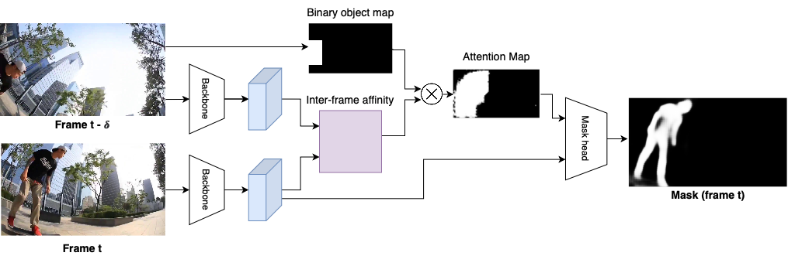

# ObjProp

## Introduction
This is the official implementation of the paper "Object Propagation via Inter-Frame Attentions for Temporally Stable Video Instance Segmentation".


## Installation
This repo is built using [mmdetection](https://github.com/open-mmlab/mmdetection). 
To install the dependencies, first clone the repository locally:
```
git clone https://github.com/anirudh-chakravarthy/objprop.git
```
Then, install PyTorch 1.1.0, torchvision 0.3.0, mmcv 0.2.12:
```
conda install pytorch==1.1.0 torchvision==0.3.0 -c pytorch
pip install mmcv==0.2.12
```
Then, install the CocoAPI for YouTube-VIS
```
conda install cython scipy
pip install git+https://github.com/youtubevos/cocoapi.git#"egg=pycocotools&subdirectory=PythonAPI"
```

## Training
First, download and prepare the YouTube-VIS dataset using the [following instructions](https://github.com/youtubevos/MaskTrackRCNN#training).

To train ObjProp, run the following command:
```
python3 tools/train.py configs/masktrack_rcnn_r50_fpn_1x_youtubevos_objprop.py
```
In order to change the arguments such as dataset directory, learning rate, number of GPUs, etc, refer to the following configuration file `configs/masktrack_rcnn_r50_fpn_1x_youtubevos_objprop.py`.

## Inference
To perform inference using ObjProp, run the following command:
```
python3 tools/test_video.py configs/masktrack_rcnn_r50_fpn_1x_youtubevos_objprop.py [MODEL_PATH] --out [OUTPUT_PATH.json] --eval segm
```

A JSON file with the inference results will be saved at `OUTPUT_PATH.json`. To evaluate the performance, submit the result file to the [evaluation server](https://competitions.codalab.org/competitions/20128).

## License

## Citation